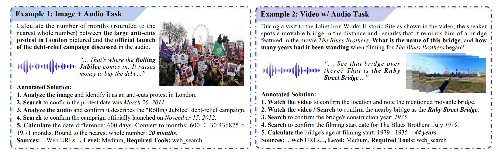
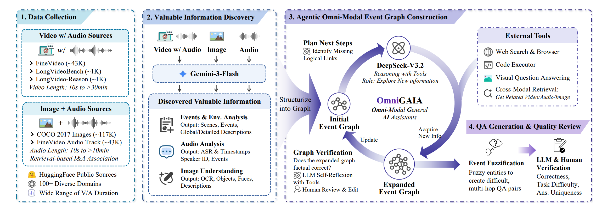
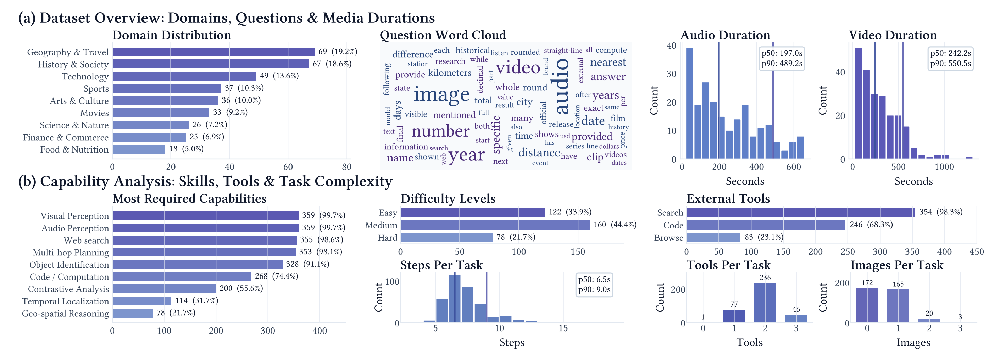
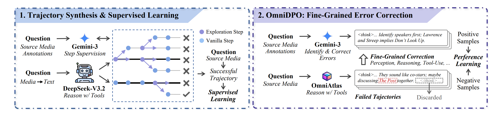

<h1 align="center">OmniGAIA: Towards Native Omni-Modal AI Agents</a></h1>


<div align="center">

[](https://arxiv.org/abs/) 
[](https://huggingface.co/collections/RUC-NLPIR/omnigaia)
[](https://huggingface.co/spaces/RUC-NLPIR/OmniGAIA-Leaderboard)
[](https://opensource.org/licenses/MIT) 
[](https://www.python.org/downloads/release/python-3100/)
<!-- [](https://x.com/RUC_NLPIR/status/1777017075399684133) -->

</div>


<p align="center">
🤗 <a href="https://huggingface.co/datasets/RUC-NLPIR/Omnimodal-Agent-SFT-2K" target="_blank">Omnimodal-Agent-SFT-2K</a> ｜
🤗 <a href="https://huggingface.co/RUC-NLPIR/OmniAtlas-Qwen2.5-3B" target="_blank">OmniAtlas-3B</a> ｜
🤗 <a href="https://huggingface.co/RUC-NLPIR/OmniAtlas-Qwen2.5-7B" target="_blank">OmniAtlas-7B</a> ｜
🤗 <a href="https://huggingface.co/RUC-NLPIR/OmniAtlas-Qwen3-30B-A3B" target="_blank">OmniAtlas-30B-A3B</a>
</p>

<h5 align="center"> If you like our project, please give us a star ⭐ on GitHub for the latest update.</h5>

<!-- 
<div align="center">
  
</div> -->


## 📣 Latest News

- **[Feb 27, 2026]**: 📄 Our paper is now available on **[arXiv](https://arxiv.org/abs/2602.xxxxx)** and **[Hugging Face](https://huggingface.co/papers/2602.xxxxx)**.
- **[Feb 27, 2026]**: 📈 Our OmniGAIA benchmark and OmniAtlas models are now available on **[Hugging Face](https://huggingface.co/collections/RUC-NLPIR/omnigaia)**.
- **[Feb 27, 2026]**: 🚀 Full codebase released. You can now deploy omni-modal AI agents for images, audio, and video, along with research tools.


## 🎬 Demo

### 1. Agentic Reasoning on "Image + Audio" Scenario


<div align="center">
  <video src="https://github.com/user-attachments/assets/e5778d63-bc82-485d-8eef-f3aaa1a85dba" />
</div>


### 2. Agentic Reasoning on "Video w/ Audio" Scenario

<div align="center">
  <video src="https://github.com/user-attachments/assets/29fc2487-1240-4108-89e3-190677b40b22" />
</div>


## 💡 Overview

**OmniGAIA** is a comprehensive benchmark designed to evaluate the capabilities of omni-modal general AI assistants. Unlike existing benchmarks that focus on a single modality, OmniGAIA requires agents to jointly reason over **video**, **audio**, and **image** inputs while leveraging external tools such as web search and code execution.

We also introduce **OmniAtlas**, an agentic reasoning system that extends a base LLM with *active perception* tools, enabling the model to request and examine additional media segments during multi-step reasoning.

<!-- ### ✨ Key Highlights

- **Omni-Modal Benchmark:** 360 human-verified QA pairs spanning 9 domains, requiring joint understanding of video, audio, and image content.
- **Agentic Event-Graph Construction:** A novel pipeline that builds structured event graphs from multi-modal sources using Gemini-3-Flash and DeepSeek-V3.2 with tool-augmented reasoning.
- **External Tool Integration:** Agents are equipped with web search & browsing, code execution, and cross-modal retrieval tools.
- **OmniAtlas Agent:** A fine-tuned agent with active perception capabilities and preference learning via OmniDPO.
- **Multi-Dimensional Evaluation:** Tasks are categorised by difficulty (Easy / Medium / Hard) and domain, with both exact-match and LLM-based equivalence metrics. -->

### 🎯 Task Examples

<div align="center">
  
</div>

### 📊 Benchmark Construction

<div align="center">
  
</div>

The OmniGAIA construction pipeline consists of four stages:
1. **Data Collection** — Curating video (with audio) and image+audio sources from FineVideo, LongVideoBench, LongVideo-Reason, COCO 2017, and HuggingFace, covering 100+ diverse domains.
2. **Valuable Information Discovery** — Using Gemini-3-Flash to extract events, environmental analysis, audio analysis (ASR, speaker ID), and image understanding (OCR, objects, faces).
3. **Agentic Omni-Modal Event Graph Construction** — DeepSeek-V3.2 iteratively expands an initial event graph by planning next steps, acquiring new information via tools, and verifying factual correctness with LLM self-reflexion and human review.
4. **QA Generation & Quality Review** — Generating difficult, multi-hop QA pairs through event fuzzification, followed by LLM and human verification for correctness, task difficulty, answer uniqueness.

### 📈 Benchmark Statistics

<div align="center">
  
</div>

**Core statistics:**
- **360** QA pairs across **9** domains (Geography, History, Technology, Sports, Arts, Movies, Science, Finance, Food)
- **3** difficulty levels — Easy (33.9%), Medium (44.4%), Hard (21.7%)
- **Median video duration:** 242.2s | **Median audio duration:** 197.0s
- **98.6%** require web search; **74.4%** require code / computation

### 🤖 OmniAtlas Training Pipeline

<div align="center">
  
</div>

OmniAtlas is trained in two stages:
1. **Trajectory Synthesis & Supervised Learning** — Gemini-3 provides step supervision while DeepSeek-V3.2 performs tool-augmented reasoning. Successful trajectories are used for SFT.
2. **OmniDPO: Fine-Grained Error Correction** — Gemini-3 identifies and corrects errors in failed trajectories across perception, reasoning, and tool-use dimensions, producing preference pairs for DPO training.


## 🔧 Installation

### Environment Setup

```bash
# Create conda environment
conda create -n omnigaia python=3.10
conda activate omnigaia

# Clone the repository
git clone https://github.com/RUC-NLPIR/OmniGAIA.git
cd OmniGAIA

# Install dependencies
pip install -r requirements.txt
```

### System Dependencies

- **ffmpeg** is required for video/audio processing in OmniAtlas:
  ```bash
  # Ubuntu / Debian
  sudo apt-get install ffmpeg

  # macOS
  brew install ffmpeg

  # Windows (via Chocolatey)
  choco install ffmpeg
  ```

### Configuration File

All runtime configuration is managed via `config/config.json`, where you need to set:
- Main agent endpoint (`agent.api_base_url`, `agent.api_key`, `agent.model_name`)
- Evaluation LLM endpoint (`evaluation.base_url`, `evaluation.api_key`, `evaluation.model`)
- Web search API key (`web_tools.serper_api_key`)
- Jina API key (`web_tools.jina_api_key`)


## 🏃 Quick Start

### Pre-preparation

#### 1. Model Serving

Before running agents, ensure your LLM and auxiliary models are served via an OpenAI-compatible API (e.g. using [vLLM](https://github.com/vllm-project/vllm), [SGLang](https://github.com/sgl-project/sglang), or a cloud API):

```bash
# Example: serve OmniAtlas-Qwen3-30B-A3B with vLLM
vllm serve /path/to/your/OmniAtlas-Qwen3-30B-A3B \
    --served-model-name omniatlas-30b \
    --port 8080 \
    --host 0.0.0.0 \
    --tensor-parallel-size 8 \
    --gpu-memory-utilization 0.9 \
    --trust-remote-code \
    --enable-auto-tool-choice \
    --tool-call-parser hermes \
    --uvicorn-log-level debug \
    --max-model-len 65536 
```

#### 2. Benchmark Data

Place the benchmark JSON and media files under the `data/` directory:

```
data/
├── test_metadata.json      # Benchmark questions
├── videos/                 # Video files referenced in questions
├── audios/                 # Audio files referenced in questions
└── images/                 # Image files referenced in questions
```

- `test_metadata.json` can be downloaded from:
  https://huggingface.co/datasets/RUC-NLPIR/OmniGAIA/blob/main/raw/test_metadata.json
- `videos/`, `audios/`, and `images/` can be downloaded from:
  https://huggingface.co/datasets/RUC-NLPIR/OmniGAIA/tree/main/data_media_test

### Running the Baseline Agent

The baseline agent supports both **Gemini** and **Qwen** model families. The model family is auto-detected from the `--model_name` argument.

```bash
# ── Run with Gemini ──────────────────────────────────────────────
python src/run_base_agent.py \
    --input_file ./data/test_metadata.json \
    --api_base_url "https://your-gemini-endpoint/v1" \
    --model_name "gemini-3-flash" \
    --api_key "YOUR_API_KEY" \
    --concurrent_limit 16

# ── Run with Qwen (OpenAI-compatible endpoint) ──────────────────
python src/run_base_agent.py \
    --input_file ./data/test_metadata.json \
    --api_base_url "http://localhost:8000/v1" \
    --model_name "qwen3-omni-30b-a3b-thinking" \
    --api_key "empty" \
    --concurrent_limit 16
```

**Parameters:**

| Parameter | Description |
|---|---|
| `--input_file` | Path to the benchmark JSON file |
| `--api_key` | API key for the model endpoint |
| `--api_base_url` | Base URL of the model API |
| `--model_name` | Model identifier (auto-selects Gemini vs Qwen agent) |
| `--level` | Filter by difficulty: `Easy`, `Medium`, or `Hard` |
| `--max_items` | Limit the number of items to process |
| `--concurrent_limit` | Maximum concurrent API calls (default: 5) |
| `--max_action_limit` | Maximum number of tool-call turns before forced final answer (default: 50) |
| `--use_asr` | Use Whisper ASR to convert audio to text (for text-only models) |
| `--enable-active-perception` | Enable `read_video` / `read_audio` / `read_image` tools (Qwen/OmniAtlas models only) |
| `--output_dir` | Directory for results (default: `./outputs`) |
| `--request_timeout` | Per-request timeout in seconds (default: 600) |
| `--forced_final_timeout` | Timeout for forced final answer after max turns (default: 300) |
| `--ffmpeg_timeout` | Timeout for ffmpeg-related media processing (default: 180) |
| `--item_timeout` | Max total processing time (default: 36000 (10 hours)) |
| `--eval_timeout` | Timeout for LLM equivalence evaluation (default: 120) |
| `--skip_eval` | Skip LLM-based equivalence evaluation |

### Running OmniAtlas Agent Mode

OmniAtlas behavior is enabled in `run_base_agent.py` via `--enable-active-perception` (Qwen/OmniAtlas models only). This allows the model to request specific video/audio/image segments during reasoning:

```bash
python src/run_base_agent.py \
    --input_file ./data/test_metadata.json \
    --api_base_url "http://localhost:8000/v1" \
    --model_name "omniatlas-30b" \
    --api_key "empty" \
    --enable-active-perception \
    --concurrent_limit 16
```


## 📊 Evaluation

### Automatic Evaluation

`run_base_agent.py` automatically evaluates results after generation. The evaluation includes:

- **Exact Match (EM):** Normalised string comparison between the predicted answer and ground truth.
- **LLM Equivalence:** An LLM judge (e.g. DeepSeek-V3) determines whether the predicted answer is semantically equivalent to the ground truth.

Results and metrics are saved to the `outputs/` directory.

### Re-evaluate Existing Results

To re-run evaluation on previously generated results (e.g. with a different evaluation model):

```bash
python src/evaluate/eval_results.py \
    --input_file ./outputs/base_agent_omniatlas-30b/run_20260101_120000_em0.2500_llmeq0.4000.json \
    --test_file_path ./data/test_metadata.json \
    --concurrent_limit 64
```

**Parameters:**

| Parameter | Description |
|---|---|
| `--input_file` | Path to the results JSON from a previous run |
| `--test_file_path` | (Optional) Original test JSON to recover missing category labels |
| `--concurrent_limit` | Maximum concurrent evaluation API calls (default: 64) |

### Output Format

Each run produces two files:
- `run_<timestamp>_em<score>_llmeq<score>.json` — Per-item results with predictions, messages, and scores.
- `run_<timestamp>_em<score>_llmeq<score>_metrics.json` — Aggregated metrics (overall, by difficulty level, and by category).

Example metrics output:
```
==================================================
Total Items:            360
Average EM Score:       0.2500
Average LLM Equal Score:0.4000
Average Tool Calls:     6.50
Non-Empty Answer Ratio: 0.9800
--------------------
Easy     (n=122): EM=0.3500, LLM_Eq=0.5200
Medium   (n=160): EM=0.2300, LLM_Eq=0.3800
Hard     (n=78 ): EM=0.1400, LLM_Eq=0.2600
--------------------
Geo.  (n=69 ): EM=0.2800, LLM_Eq=0.4200
Tech. (n=49 ): EM=0.2600, LLM_Eq=0.4100
...
==================================================
```


## 🛠️ Tools

OmniGAIA agents are equipped with the following external tools:

| Tool | Description | Key Dependencies |
|---|---|---|
| **Web Search** | Google search via Serper API with result caching | `aiohttp`, Serper API |
| **Page Browser** | Fetch and extract webpage content via Jina Reader API | `aiohttp`, `beautifulsoup4`, Jina API |
| **Code Executor** | Sandboxed Python execution with common scientific libraries | Built-in (`exec`/`eval`) |
| **Active Perception** *(OmniAtlas only)* | `read_video`, `read_audio`, `read_image` — request specific media segments during reasoning | `opencv-python`, `pydub`, `ffmpeg` |


## 📄 Citation
If you find this work helpful, please cite our paper:

@misc{li2026omnigaia,
      title={OmniGAIA: Towards Native Omni-Modal AI Agents}, 
      author={Xiaoxi Li and Wenxiang Jiao and Jiarui Jin and Shijian Wang and Guanting Dong and Jiajie Jin and Hao Wang and Yinuo Wang and Ji-Rong Wen and Yuan Lu and Zhicheng Dou},
      year={2026},
      eprint={2602.xxxxx},
      archivePrefix={arXiv},
      primaryClass={cs.AI},
      url={https://arxiv.org/abs/2602.xxxxx}, 
}

## 📄 License
This project is released under the MIT License.

##  📞 Contact
For any questions or feedback, please reach out to us at xiaoxi_li@ruc.edu.cn.

